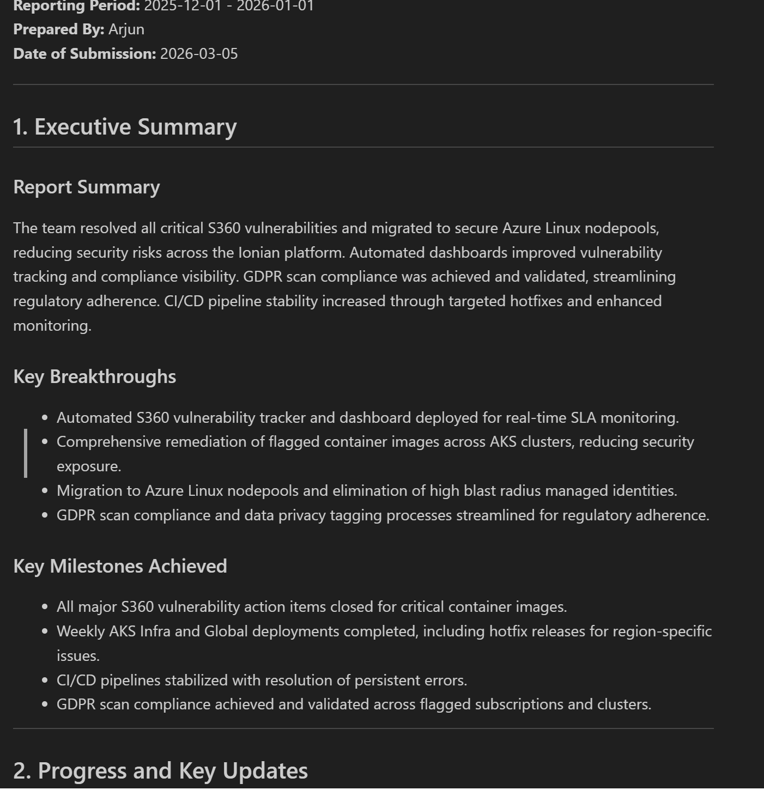
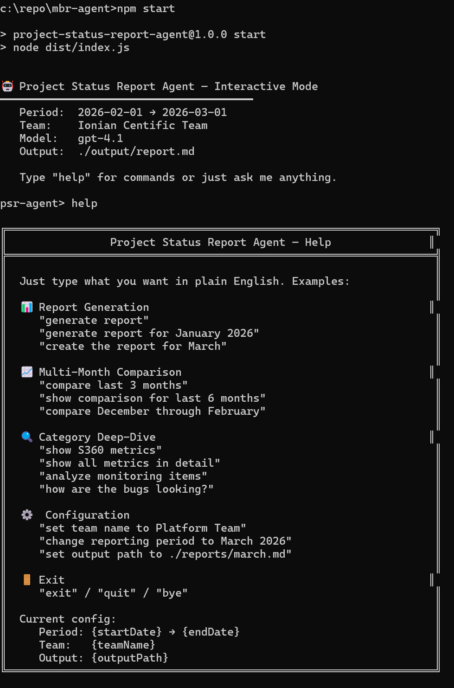

# Project Status Report Agent

AI-powered agent that fetches Azure DevOps work items, generates LLM-summarized sections, and produces formatted project status reports.



## Features

- **Azure DevOps Integration** — Queries work items via WIQL, fetches details and comments
- **LLM Summarization** — Uses OpenAI, Azure OpenAI, or a local Ollama model (e.g. Llama) to generate executive summaries, progress tables, metrics, challenges, and next steps
- **Multi-Month Comparison** — Compare metrics across multiple reporting periods
- **Template Engine** — Populates a Markdown template with structured report data
- **Interactive Agent** — Conversational REPL for on-demand report generation and analysis
- **Static Mode** — One-shot CLI for automated report generation

## Project Structure

```
src/               TypeScript source files
  types.ts         Shared interfaces and type definitions
  config.ts        Environment variable loader
  ado-client.ts    Azure DevOps WIQL client
  extractor.ts     Work item categorizer and HTML stripper
  summarizer.ts    LLM-powered section generation
  refiner.ts       Second-pass LLM refinement
  template-engine.ts  Template population engine
  report-generator.ts Full pipeline orchestrator
  agent.ts         Interactive conversational agent (REPL)
  index.ts         CLI entry point
test/              Vitest test files
  config.test.ts
  extractor.test.ts
  template-engine.test.ts
dist/              Compiled JavaScript output (generated)
output/            Generated reports
docs/              Documentation
```

## Setup

1. Install dependencies:
   ```bash
   npm install
   ```

2. Copy `.env.example` to `.env` and fill in your credentials:
   ```
   ADO_ORG_URL=https://dev.azure.com/yourorg
   ADO_PAT=your-personal-access-token
   ADO_PROJECT=YourProject
   LLM_PROVIDER=azure-openai
   LLM_API_KEY=your-api-key
   LLM_MODEL=gpt-4o
   TEAM_NAME=YourTeam
   CLIENT_NAME=YourClient
   PREPARED_BY=YourName
   REPORT_START_DATE=2026-01-01
   REPORT_END_DATE=2026-02-01
   ```

### Running locally with Ollama (no cloud LLM required)

Instead of using Azure OpenAI (which requires an Azure subscription, deployed model, and API key), you can run the entire agent locally using [Ollama](https://ollama.com/) — a free, open-source tool that runs LLMs on your own machine.

#### 1. Install Ollama

- **Windows**: Download the installer from [ollama.com/download](https://ollama.com/download)
- **macOS**: `brew install ollama`
- **Linux**: `curl -fsSL https://ollama.com/install.sh | sh`

#### 2. Pull a model

```bash
ollama pull llama3
```

Other compatible models: `llama3:70b`, `mistral`, `codellama`, `gemma2`. Larger models produce better summaries but require more RAM/VRAM.

#### 3. Start the Ollama server

```bash
ollama serve
```

By default this runs on `http://localhost:11434`. Keep this running in a separate terminal.

#### 4. Configure `.env` for Ollama

```
# ── LLM (Local — Ollama) ───────────────────────────────────────────────
LLM_PROVIDER=ollama
LLM_ENDPOINT=http://localhost:11434/v1
LLM_MODEL=llama3
# LLM_API_KEY is not needed — automatically handled for Ollama
```

All other settings (ADO credentials, reporting period, team info, etc.) remain the same as the cloud setup.

#### 5. Build and run

```bash
npm run build
npm start
```

> **Note:** Ollama runs inference locally, so generation speed depends on your hardware. A machine with a GPU will be significantly faster. The agent works the same way regardless of provider — only the LLM backend differs.

3. Build:
   ```bash
   npm run build
   ```

## Usage

The agent supports two execution modes: **Interactive** and **Static**. Both modes use the same underlying pipeline — fetch work items from Azure DevOps, categorize them, summarize via LLM, and produce a Markdown report.

### Interactive Mode (default)

```bash
npm start
# or explicitly:
node dist/index.js
```

Interactive mode starts a conversational REPL with a `psr-agent>` prompt. The agent uses the configured LLM to parse your natural language input into structured intents, so you can issue commands conversationally. It maintains a session with cached ADO data to avoid re-fetching between commands.



**Available commands:**

| Command | Description |
|---------|-------------|
| `generate report` | Generate a full report for the configured period (`REPORT_START_DATE` → `REPORT_END_DATE`) |
| `generate report for January 2026` | Generate a report for a specific period (the agent infers the date range) |
| `compare last 3 months` | Fetch multiple months and produce a multi-month trend comparison |
| `show S360 metrics` | Deep-dive into a specific category (s360, icm, rollout, monitoring, support, bugs, blockers, or all) |
| `polish the executive summary` | Re-summarize or refine a specific section (executive, progress, metrics, challenges, next_steps, comparison, or all) |
| `set team name to Platform Team` | Override any config value at runtime without restarting |
| `help` | Show all available commands |
| `exit` | Quit the agent |

**Example session:**
```
psr-agent> generate report for February 2026
  ⏳ Fetching work items for 2026-02-01 → 2026-03-01...
  ✓ 42 items fetched (35 completed, 3 bugs)
  ...
  ✅ Report saved to ./output/report.md

psr-agent> compare last 3 months
  ⏳ Fetching work items for Dec 2025, Jan 2026, Feb 2026...
  ✓ Comparison table generated

psr-agent> show all metrics in detail
  ...

psr-agent> exit
```

### Static Mode (one-shot)

```bash
npm run start:static
# or explicitly:
node dist/index.js --static
node dist/index.js -s
```

Static mode generates a single report using the date range in `.env` and exits immediately. There is no interactive prompt — it runs the full pipeline end-to-end and writes the output file.

This is ideal for:
- **CI/CD pipelines** — trigger report generation on a schedule
- **Cron jobs** — automate monthly reports without manual intervention
- **Scripting** — chain with other tools (e.g. email the report, commit to a repo)

## Testing

```bash
npm test
```

## Configuration

All configuration is via environment variables (loaded from `.env`):

| Variable | Required | Description |
|----------|----------|-------------|
| `ADO_ORG_URL` | Yes | Azure DevOps organization URL |
| `ADO_PAT` | Yes | Personal Access Token |
| `ADO_PROJECT` | Yes | Project name |
| `LLM_API_KEY` | Yes* | OpenAI / Azure OpenAI API key (*not required for Ollama) |
| `LLM_PROVIDER` | No | `openai`, `azure-openai`, or `ollama` (default: `openai`) |
| `LLM_ENDPOINT` | No | LLM API endpoint (required for `azure-openai` and `ollama`, e.g. `http://localhost:11434/v1`) |
| `LLM_MODEL` | No | Model name (default: `gpt-4o`) |
| `TEAM_NAME` | No | Team name for report header |
| `CLIENT_NAME` | No | Client name for report header |
| `PREPARED_BY` | No | Author name |
| `REPORT_START_DATE` | Yes | Period start (YYYY-MM-DD) |
| `REPORT_END_DATE` | Yes | Period end (YYYY-MM-DD) |
| `TEMPLATE_PATH` | No | Path to report template |
| `OUTPUT_PATH` | No | Output file path (default: `./output/report.md`) |
| `VERBOSE` | No | Enable verbose logging (`true`/`false`) |
